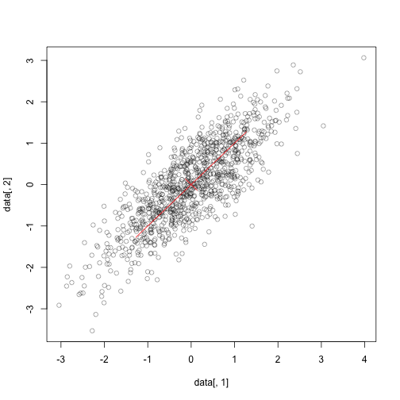
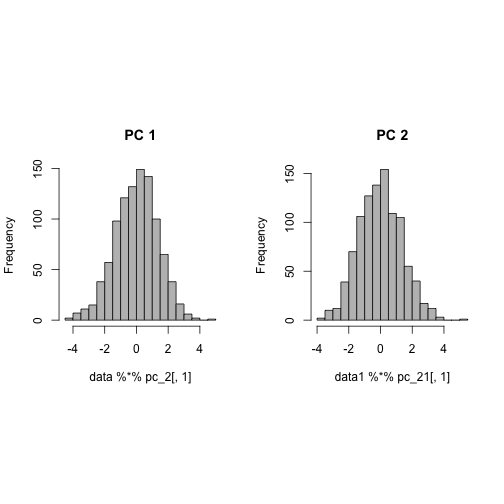

Assignment
========================================================


```r
# old.par <- par(mar = c(0, 0, 0, 0))
genDataPCA <- function(x, y, rot, flag) {
    mat <- matrix(1000, 1000, 2)
    mat[, 1] <- x
    mat[, 2] <- y
    data <- mat %*% rot
    if (flag == 1) {
        plot(data[, 1], data[, 2], col = rgb(0, 0, 0, 0.4))
    }
    data
}
pca <- function(data, k) {
    # covariance.mat <- t(data) %*% data
    covariance.mat <- cov(data)
    eig.vecs <- eigen(covariance.mat)$vectors
    eig.vals <- eigen(covariance.mat)$values
    k.components <- eig.vecs[, 1:k]
    k.components
}
x <- rnorm(1000, mean = 0, sd = 1)
y <- rnorm(1000, mean = 0, sd = 1)
rot <- matrix(c(1, 2, 2, 1), 2, 2)
rot1 <- matrix(c(1, -2, -2, 1), 2, 2)
data <- genDataPCA(x, y, rot, 1)
covariance.mat <- cov(data)
data <- genDataPCA(x, y, rot, 1)
data1 <- genDataPCA(x, y, rot1, 0)
pc_21 <- pca(data1, 2)
# For Data 1
pc_2 <- pca(data, 2)
eig.vecs <- eigen(covariance.mat)$vectors
eig.vals <- eigen(covariance.mat)$values
evecs1 <- pc_2[, 1] * eig.vals[1]
evecs2 <- pc_2[, 2] * eig.vals[2]
lines(x = c(0, evecs1[1]), y = c(0, evecs1[2]), col = "red")
lines(x = c(0, -evecs1[1]), y = c(0, -evecs1[2]), col = "red")
```

 


```r
par(mfrow = c(1, 2), pty = "s")
hist(data %*% pc_2[, 1], 20, col = "gray", main = "PC 1")
hist(data1 %*% pc_21[, 1], 20, col = "gray", main = "PC 2")
```

 

```r
variance.1 <- var(data %*% pc_2[, 1])
variance.2 <- var(data1 %*% pc_21[, 1])
variance.1
```

```
##       [,1]
## [1,] 8.377
```

```r
cov(data)
```

```
##       [,1]  [,2]
## [1,] 4.583 3.662
## [2,] 3.662 4.842
```

```r
variance.2
```

```
##       [,1]
## [1,] 9.456
```

```r
cov(data1)
```

```
##        [,1]   [,2]
## [1,]  5.063 -4.262
## [2,] -4.262  5.322
```


### We can observe that the trace of covariance matrix is equal to the variance along the principle direction.


