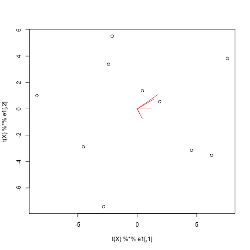

Assignment
========================================================


```r
# old.par <- par(mar = c(0, 0, 0, 0))
genDataPCA <- function(x, y, rot, flag) {
    mat <- matrix(1000, 1000, 2)
    mat[, 1] <- x
    mat[, 2] <- y
    data <- mat %*% rot
    # rm <- rowMeans(data) data <- data - matrix(rep(rm, 2), 1000)
    stardz <- function(x) {
        (x - mean(x))/sd(x)
    }
    data <- apply(data, MARGIN = 2, FUN = stardz)
    if (flag == 1) {
        plot(data[, 1], data[, 2], col = rgb(0, 0, 0, 0.4))
    }
    data
}
pca <- function(data, k) {
    # covariance.mat <- t(data) %*% data
    covariance.mat <- cov(data)
    eig.vecs <- eigen(covariance.mat)$vectors
    eig.vals <- eigen(covariance.mat)$values
    k.components <- eig.vecs[, 1:k]
    k.components
}
x <- rnorm(1000, mean = 0, sd = 1)
y <- rnorm(1000, mean = 0, sd = 1)
rot <- matrix(c(1, 2, 2, 1), 2, 2)
rot1 <- matrix(c(1, -2, -2, 1), 2, 2)
data <- genDataPCA(x, y, rot, 1)
covariance.mat <- cov(data)
data <- genDataPCA(x, y, rot, 1)
data1 <- genDataPCA(x, y, rot1, 0)
pc_21 <- pca(data1, 2)
# For Data 1
pc_2 <- pca(data, 2)
eig.vecs <- eigen(covariance.mat)$vectors
eig.vals <- eigen(covariance.mat)$values
evecs1 <- pc_2[, 1] * eig.vals[1]
evecs2 <- pc_2[, 2] * eig.vals[2]
lines(x = c(0, evecs1[1]), y = c(0, evecs1[2]), col = "red")
lines(x = c(0, -evecs1[1]), y = c(0, -evecs1[2]), col = "red")
lines(x = c(0, evecs2[1]), y = c(0, evecs2[2]), col = "red")
lines(x = c(0, -evecs2[1]), y = c(0, -evecs2[2]), col = "red")
```

 


```r
par(mfrow = c(1, 2), pty = "s")
hist(data %*% pc_2[, 1], 20, col = "gray", main = "PC 1")
hist(data1 %*% pc_21[, 1], 20, col = "gray", main = "PC 2")
```

 

```r
variance.1 <- var(data %*% pc_2[, 1])
variance.2 <- var(data1 %*% pc_21[, 1])
variance.1
```

```
##       [,1]
## [1,] 1.804
```

```r
cov(data)
```

```
##        [,1]   [,2]
## [1,] 1.0000 0.8043
## [2,] 0.8043 1.0000
```

```r
variance.2
```

```
##       [,1]
## [1,] 1.796
```

```r
cov(data1)
```

```
##         [,1]    [,2]
## [1,]  1.0000 -0.7959
## [2,] -0.7959  1.0000
```


### We can observe that the trace of covariance matrix is equal to the variance along the principle direction.

```r
x1 <- rnorm(1000, mean = 0, sd = 1)
x2 <- rnorm(1000, mean = 0, sd = sqrt(3))
rotv <- c(1, 1, -1, 1)/sqrt(2)
rot2 <- matrix(rotv, 2, 2)
d1 <- genDataPCA(x1, x2, rot2, 1)
```

 


Covariance and Eigenvectors

```r
cov(d1)
```

```
##        [,1]   [,2]
## [1,] 1.0000 0.5436
## [2,] 0.5436 1.0000
```

```r
eigen(cov(d1))
```

```
## $values
## [1] 1.5436 0.4564
## 
## $vectors
##        [,1]    [,2]
## [1,] 0.7071 -0.7071
## [2,] 0.7071  0.7071
```


Exercise 2


```r
X <- matrix(c(5, -2, 0, 0, 3, 3, -1, 1, 2, 4, 0, 0, 4, 3, -2, 1, 0, -1, 0, 1, 
    -1, 1, 0, -1, 3, -3, 4, 5, 3, -3, 5, -3, 5, 3, -3, 0, 1, -5, -7, 2, -4, 
    5, -3, -2, 0, -4, 3, -3, 0, 0), nrow = 5, ncol = 10)
# stardz <- function(x) {(x-mean(x))/sd(x)} dataX <- apply(t(X), MARGIN = 2,
# FUN = stardz)
Xeig.vecs <- eigen(cov(t(X)))$vectors
Xeig.vals <- eigen(cov(t(X)))$values
Xeig.vecs
```

```
##         [,1]    [,2]     [,3]     [,4]     [,5]
## [1,] -0.4170  0.6393  0.19905 -0.01067 -0.61457
## [2,]  0.3237 -0.4736 -0.15753  0.23894 -0.76746
## [3,] -0.6399 -0.2777 -0.02308  0.70500  0.12572
## [4,] -0.5184 -0.2841 -0.54868 -0.58058 -0.11140
## [5,]  0.2075  0.4574 -0.79623  0.32970  0.07132
```

```r
ev <- Xeig.vals
e1 <- Xeig.vecs[, 1:2]
plot(t(X) %*% e1)
for (j in 1:dim(e1)[1]) {
    lines(x = c(0, sqrt(ev[1]) * e1[j, 1]), y = c(0, sqrt(ev[2]) * e1[j, 2]), 
        col = "red")
}
```

 


```r
dGetUij <- function(i, j, Kd, A, U, lamdaij) {
    return(sum(Kd[, j] * A[, i]))
}
dGetlamdaij <- function(i, j, U) {
    U.tilda <- U %*% t(U)
    return((i == j) - U.tilda[i, j])
}
getU <- function(new.U, mu.U, new.lambda) {
    newdU <- 0 * new.U
    nc <- dim(U)[1]
    nr <- dim(U)[2]
    for (j in 1:nc) {
        for (i in 1:nr) {
            newdU[i, j] <- dGetUij(i, j, Kd, A, new.U, new.lambda)
        }
    }
    newdU <- newdU - new.lambda * ((2 * diag(1, 2) * new.U) + diag(1, 2)[2:1, 
        ])
    new.U <- new.U + mu.U * newdU
    new.U
}

getLambda <- function(new.U, new.lambda, mu.lambda) {
    dlambda <- 0 * new.lambda
    nc <- dim(new.lambda)[1]
    nr <- dim(new.lambda)[2]
    for (j in 1:nc) {
        for (i in 1:nr) {
            dlambda[i, j] <- dGetlamdaij(i, j, new.U)
        }
    }
    new.lambda <- new.lambda + mu.lambda * dlambda
    new.lambda
}

############################################ 
arr.new <- c(-0.9511, -1.6435, 2.3655, -2.9154, -3.701, 0.9511, -1.6435, 2.3655, 
    -2.9154, 3.701)
A <- matrix(arr.new, ncol = 2, nrow = 5)
U <- matrix(1:4, 2, 2)
U <- U * 0.1
new.U <- eigen(U)$vectors
K <- A %*% new.U
Kd <- 4 * K * K * K
new.lambda <- matrix(10:13, 2, 2)
mu.lambda <- 0.01
mu.U <- 0.01
rotFA <- function(A, new.U, new.lambda, mu.lambda, mu.U) {
    for (iter in 1:600) {
        new.U <- getU(new.U, mu.U, new.lambda)
        new.U <- eigen(U)$vectors
        new.lambda <- getLambda(new.U, new.lambda, mu.lambda)
        temp <- A %*% new.U
    }
    temp
}
e1 <- Xeig.vecs[, 1:2]
Astar <- rotFA(e1, new.U, new.lambda, mu.lambda, mu.U)
Astar
```

```
##         [,1]      [,2]
## [1,] -0.2912  0.645162
## [2,]  0.2074 -0.491352
## [3,]  0.5910  0.466447
## [4,]  0.5276  0.353220
## [5,] -0.4945  0.001564
```

```r
plot(t(X) %*% e1)
# biplot(e1, 1:5)
for (j in 1:dim(e1)[1]) {
    lines(x = c(0, Astar[j, 1] * sqrt(ev[1]) * Astar[j, 1]), y = c(0, Astar[j, 
        1] * sqrt(ev[2]) * Astar[j, 2]), col = "red")
}
```

 


